# System Architecture Analysis
<!-- generated in 0.00s -->

## Overview

- **Project**: /home/tom/github/if-uri/connect.ifuri.com
- **Primary Language**: json
- **Languages**: json: 70, php: 18, python: 7, shell: 4, javascript: 2
- **Analysis Mode**: static
- **Total Functions**: 113
- **Total Classes**: 0
- **Modules**: 103
- **Entry Points**: 63

## Architecture by Module

### assets.app
- **Functions**: 60
- **File**: `app.js`

### tools.audit_connector_repos
- **Functions**: 26
- **File**: `audit_connector_repos.py`

### assets.ifuri-ecobar
- **Functions**: 12
- **File**: `ifuri-ecobar.js`

### tools.build_catalog
- **Functions**: 6
- **File**: `build_catalog.py`

### scripts.connector-template.pkg.core
- **Functions**: 5
- **File**: `core.py`

### scripts.sign-manifest
- **Functions**: 2
- **File**: `sign-manifest.php`

### scripts.validate_connectors
- **Functions**: 2
- **File**: `validate_connectors.py`

### scripts.connector-template.pkg.cli
- **Functions**: 2
- **File**: `cli.py`

### scripts.check_connectors
- **Functions**: 2
- **File**: `check_connectors.py`

## Key Entry Points

Main execution flows into the system:

### scripts.check_connectors.main
- **Calls**: argparse.ArgumentParser, ap.add_argument, ap.add_argument, ap.add_argument, ap.parse_args, print, sorted, print

### scripts.validate_connectors.main
- **Calls**: Draft202012Validator, set, sorted, scripts.validate_connectors.load, sorted, sorted, sorted, print

### assets.app.builder
- **Calls**: assets.app.getElementById, assets.app.split, assets.app.map, assets.app.trim, assets.app.filter, assets.app.String, assets.app.replaceAll, assets.app.namedItem

### tools.audit_connector_repos.main
- **Calls**: argparse.ArgumentParser, parser.add_argument, parser.add_argument, parser.add_argument, parser.add_argument, parser.add_argument, parser.parse_args, args.output.parent.mkdir

### scripts.connector-template.pkg.cli.main
- **Calls**: argparse.ArgumentParser, parser.add_subparsers, sub.add_parser, r.add_argument, r.add_argument, sub.add_parser, sub.add_parser, parser.parse_args

### tools.build_catalog.main
- **Calls**: argparse.ArgumentParser, parser.add_argument, parser.parse_args, OUTPUT_PATH.write_text, print, tools.build_catalog.encode, tools.build_catalog.build_catalog, print

### assets.app.search
- **Calls**: assets.app.trim, assets.app.toLowerCase, assets.app.forEach, assets.app.includes, assets.app.toggle

### assets.app.cards
- **Calls**: assets.app.trim, assets.app.toLowerCase, assets.app.forEach, assets.app.includes, assets.app.toggle

### assets.app.count
- **Calls**: assets.app.trim, assets.app.toLowerCase, assets.app.forEach, assets.app.includes, assets.app.toggle

### assets.app.noResults
- **Calls**: assets.app.trim, assets.app.toLowerCase, assets.app.forEach, assets.app.includes, assets.app.toggle

### assets.app.filterConnectors
- **Calls**: assets.app.trim, assets.app.toLowerCase, assets.app.forEach, assets.app.includes, assets.app.toggle

### assets.app.manifest
- **Calls**: assets.app.fetch, assets.app.stringify, assets.app.json, assets.app.renderValidation, assets.app.String

### assets.ifuri-ecobar.navHTML
- **Calls**: assets.ifuri-ecobar.map, assets.ifuri-ecobar.esc, assets.ifuri-ecobar.isActive, assets.ifuri-ecobar.join

### assets.app.buttons
- **Calls**: assets.app.forEach, assets.app.addEventListener, assets.app.toggle, assets.app.setAttribute

### assets.app.panels
- **Calls**: assets.app.forEach, assets.app.addEventListener, assets.app.toggle, assets.app.setAttribute

### assets.app.target
- **Calls**: assets.app.forEach, assets.app.toggle, assets.app.setAttribute

### assets.app.term
- **Calls**: assets.app.forEach, assets.app.includes, assets.app.toggle

### assets.app.visible
- **Calls**: assets.app.forEach, assets.app.includes, assets.app.toggle

### scripts.sign-manifest.die_err
- **Calls**: scripts.sign-manifest.fwrite, scripts.sign-manifest.exit

### scripts.sign-manifest.arg_value
- **Calls**: scripts.sign-manifest.array_search, scripts.sign-manifest.isset

### assets.app.checks
- **Calls**: assets.app.filter, assets.app.map

### assets.app.command
- **Calls**: assets.app.filter, assets.app.map

### assets.app.copyInstall
- **Calls**: assets.app.filter, assets.app.map

### assets.app.selectAvailable
- **Calls**: assets.app.filter, assets.app.map

### assets.app.hubBase
- **Calls**: assets.app.filter, assets.app.map

### assets.app.suffix
- **Calls**: assets.app.encodeURIComponent, assets.app.join

### assets.app.fixText
- **Calls**: assets.app.replace, assets.app.String

### assets.app.response
- **Calls**: assets.app.fetch, assets.app.stringify

### assets.ifuri-ecobar.host
- **Calls**: assets.ifuri-ecobar.test

### assets.ifuri-ecobar.curView
- **Calls**: assets.ifuri-ecobar.test

## Process Flows

Key execution flows identified:

### Flow 1: main
```
main [scripts.check_connectors]
```

### Flow 2: builder
```
builder [assets.app]
```

### Flow 3: search
```
search [assets.app]
```

### Flow 4: cards
```
cards [assets.app]
```

### Flow 5: count
```
count [assets.app]
```

### Flow 6: noResults
```
noResults [assets.app]
```

### Flow 7: filterConnectors
```
filterConnectors [assets.app]
```

### Flow 8: manifest
```
manifest [assets.app]
```

### Flow 9: navHTML
```
navHTML [assets.ifuri-ecobar]
  └─> esc
```

### Flow 10: buttons
```
buttons [assets.app]
```

## Data Transformation Functions

Key functions that process and transform data:

### tools.build_catalog.validate_manifest
- **Output to**: sorted, set, ValueError, ValueError, ValueError

### tools.build_catalog.encode
- **Output to**: json.dumps

## Public API Surface

Functions exposed as public API (no underscore prefix):

- `scripts.check_connectors.main` - 43 calls
- `scripts.validate_connectors.main` - 37 calls
- `assets.app.builder` - 29 calls
- `tools.audit_connector_repos.detail_for` - 29 calls
- `tools.audit_connector_repos.build_report` - 26 calls
- `tools.build_catalog.validate_manifest` - 20 calls
- `tools.audit_connector_repos.main` - 18 calls
- `scripts.connector-template.pkg.cli.main` - 15 calls
- `tools.audit_connector_repos.print_report` - 15 calls
- `tools.build_catalog.build_catalog` - 13 calls
- `tools.audit_connector_repos.read_remote_file` - 13 calls
- `tools.build_catalog.main` - 12 calls
- `tools.audit_connector_repos.remote_tag_present` - 11 calls
- `tools.audit_connector_repos.discover_gh_repos` - 10 calls
- `tools.audit_connector_repos.merge_repos` - 9 calls
- `assets.app.copyText` - 8 calls
- `assets.app.renderValidation` - 8 calls
- `tools.audit_connector_repos.discover_local_repos` - 8 calls
- `tools.audit_connector_repos.local_tags` - 8 calls
- `tools.audit_connector_repos.load_manifests` - 7 calls
- `tools.audit_connector_repos.read_local_file` - 7 calls
- `assets.app.readManifest` - 6 calls
- `assets.app.search` - 5 calls
- `assets.app.cards` - 5 calls
- `assets.app.count` - 5 calls
- `assets.app.noResults` - 5 calls
- `assets.app.filterConnectors` - 5 calls
- `assets.app.manifest` - 5 calls
- `tools.audit_connector_repos.load_catalog_entries` - 5 calls
- `assets.ifuri-ecobar.navHTML` - 4 calls
- `assets.app.buttons` - 4 calls
- `assets.app.panels` - 4 calls
- `tools.build_catalog.load_json` - 4 calls
- `tools.audit_connector_repos.load_json` - 4 calls
- `tools.audit_connector_repos.pyproject_version` - 4 calls
- `assets.app.installCommand` - 3 calls
- `assets.app.target` - 3 calls
- `assets.app.term` - 3 calls
- `assets.app.visible` - 3 calls
- `assets.app.lineList` - 3 calls

## System Interactions

How components interact:

```mermaid
graph TD
    main --> ArgumentParser
    main --> add_argument
    main --> parse_args
    main --> Draft202012Validator
    main --> set
    main --> sorted
    main --> load
    builder --> getElementById
    builder --> split
    builder --> map
    builder --> trim
    builder --> filter
    main --> add_subparsers
    main --> add_parser
    main --> write_text
    main --> print
    search --> trim
    search --> toLowerCase
    search --> forEach
    search --> includes
    search --> toggle
    cards --> trim
    cards --> toLowerCase
    cards --> forEach
    cards --> includes
    cards --> toggle
    count --> trim
    count --> toLowerCase
    count --> forEach
    count --> includes
```



## Reverse Engineering Guidelines

1. **Entry Points**: Start analysis from the entry points listed above
2. **Core Logic**: Focus on classes with many methods
3. **Data Flow**: Follow data transformation functions
4. **Process Flows**: Use the flow diagrams for execution paths
5. **API Surface**: Public API functions reveal the interface

## Context for LLM

Maintain the identified architectural patterns and public API surface when suggesting changes.